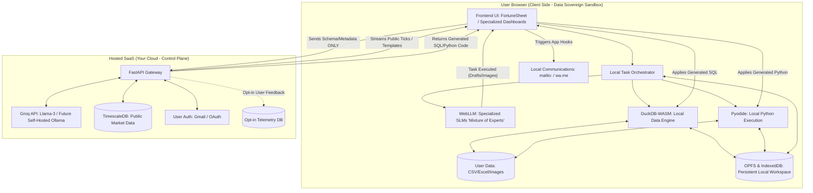

# Privacy-First "Octa Desktop" Engine

This document outlines the architecture for a hybrid, privacy-first Software-as-a-Service (SaaS). The system guarantees data sovereignty by processing sensitive user data entirely within the browser, while leveraging a powerful cloud backend strictly for generating logic (code) and supplying public data.

## 1. System Philosophy

The architecture adheres to an "OpenClaw" inspired model:
- **The Claw (Code & Compute):** The SaaS platform provides high-performance logic, code generation, and UI frameworks.
- **The Subject (Data):** The user provides the data (CSV, Excel, Hisaab-Kitab/CRM), which remains exclusively in their local browser sandbox.

## 2. Architecture Diagram

The Mermaid diagram below visualizes the strict boundaries between the user's local environment and the hosted cloud environment.

## 3. Boundary Explanations

### The Client Side (Sovereign Zone)
Everything in this zone runs in the client's memory or browser storage. Raw data (like sales figures, RFQs, HR records, or images) is loaded directly into `DuckDB-WASM` or `Pyodide`. The browser utilizes specialized UI components (like embedded `FortuneSheet` for accounting) to view this data.

**Local Persistence:** To guarantee no data loss without relying on the cloud, the application leverages the **Origin Private File System (OPFS)** and `IndexedDB`. All work done—whether it's a generated PDF research report, a collated Excel file, or a modified Myntra-format image—is aggressively saved to the local machine's persistent sandboxed storage.

**Task Orchestration:** The frontend acts as a "Traffic Cop". When a user requests an action, the Orchestrator routes the task to a specialized SLM or engine:
- *Data Crunching/Accounting/Inventory:* Routed to DuckDB-WASM and Groq for SQL generation.
- *Research & Reports:* Routed to a drafting SLM and local PDF generator.
- *Image Modification:* Routed to local Canvas/WebGL processing.
- *Communications/HR:* Routed to template engines and local hooks.

### The Cloud Side (Control Plane)
The cloud handles heavy lifting that does *not* require user data. It acts as a lightweight API gateway routing requests to high-speed external providers like `Groq` (using Llama-3) to take the user's plain-text questions and the metadata schema, and translates them into executable SQL or Python. Because only schema metadata and prompts are sent—never raw row data—the privacy guarantee remains absolute even when using third-party inference.
*Note: The system is designed to easily swap out Groq for a self-hosted `Ollama` instance (e.g., Qwen2.5-Coder) in the future for cost control or customized fine-tuning.*

The backend also exposes public datasets via `TimescaleDB` (e.g., public stock market ticks) which are streamed down to the client. The client can then join this public cloud data with their private local data inside `DuckDB-WASM`. Authentication is handled via standard Gmail/OAuth logins.

### Privacy Guardrails & Opt-In Telemetry
To maintain total privacy:
- No row-level user data ever leaves the browser sandbox.
- Emails and WhatsApp messages are executed locally by generating URLs (`wa.me` links, `mailto:` protocols), avoiding the need to send contacts to a central automation server.
- **Continuous Learning (RLHF):** Users can opt-in to share `[Prompt] -> [Corrected Code]` telemetry pairs in exchange for credits. This data will be used in the future to fine-tune self-hosted models, strictly using anonymized metadata.
