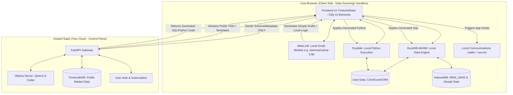

# Privacy-First "Work Done" Engine

This document outlines the architecture for a hybrid, privacy-first Software-as-a-Service (SaaS). The system guarantees data sovereignty by processing sensitive user data entirely within the browser, while leveraging a powerful cloud backend strictly for generating logic (code) and supplying public data.

## 1. System Philosophy

The architecture adheres to an "OpenClaw" inspired model:
- **The Claw (Code & Compute):** The SaaS platform provides high-performance logic, code generation, and UI frameworks.
- **The Subject (Data):** The user provides the data (CSV, Excel, Hisaab-Kitab/CRM), which remains exclusively in their local browser sandbox.

## 2. Architecture Diagram

The Mermaid diagram below visualizes the strict boundaries between the user's local environment and the hosted cloud environment.

## 3. Boundary Explanations

### The Client Side (Sovereign Zone)
Everything in this zone runs in the client's memory or browser storage. Raw data (like sales figures or client names) is loaded directly into `DuckDB-WASM` or `Pyodide` from local files. The browser UI utilizes embedded spreadsheets (`FortuneSheet`) to view this data. When the user asks a complex question about their data, the frontend only extracts the *schema* (column names and types) or metadata to send to the backend. Local communications and simple chat interactions can be augmented by in-browser models via `WebLLM`.

### The Cloud Side (Control Plane)
The cloud handles heavy lifting that does *not* require user data. It uses `Ollama` hosting `Qwen2.5-Coder` to take the user's plain-text questions and the metadata schema, and translates them into executable SQL or Python. It also exposes public datasets via `TimescaleDB` (e.g., public stock market ticks) which are streamed down to the client. The client can then join this public cloud data with their private local data inside `DuckDB-WASM`.

### No External API Reliance
To maintain total privacy and avoid reliance on third-party opaque services:
- No OpenAI API keys are used; inference is entirely local or via the self-hosted Ollama backend.
- Emails and WhatsApp messages are executed locally by generating URLs (`wa.me` links, `mailto:` protocols), avoiding the need to send contacts to a central automation server.
