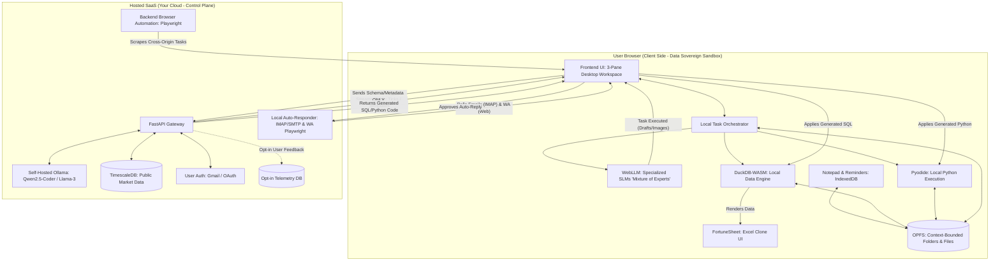

# Privacy-First "Octa Desktop" Engine

This document outlines the architecture for a hybrid, privacy-first Software-as-a-Service (SaaS). The system guarantees data sovereignty by processing sensitive user data entirely within the browser, while leveraging a powerful cloud backend strictly for generating logic (code) and supplying public data.

## 1. System Philosophy

The architecture adheres to an "OpenClaw" inspired model:
- **The Claw (Code & Compute):** The SaaS platform provides high-performance logic, code generation, and UI frameworks.
- **The Subject (Data):** The user provides the data (CSV, Excel, Hisaab-Kitab/CRM), which remains exclusively in their local browser sandbox.

## 2. Architecture Diagram

The Mermaid diagram below visualizes the strict boundaries between the user's local environment and the hosted cloud environment.

## 3. Boundary Explanations

### The Client Side (Sovereign Zone)
Everything in this zone runs in the client's memory or browser storage. Raw data (like sales figures, RFQs, HR records, or images) is loaded directly into `DuckDB-WASM` or `Pyodide`. The browser utilizes specialized UI components (like embedded `FortuneSheet` for accounting) to view this data.

**Local Persistence & Context-Bounding (The OpenClaw Approach):**
To prevent AI from being overwhelmed by infinite chat history and to provide a true "Desktop" feel, data is organized into **Folders** within the **Origin Private File System (OPFS)**.
- **Context Isolation:** When a user selects a folder (e.g., "Q3 Accounting"), the Orchestrator bounds the AI's context strictly to the files and chat history *within that folder*.
- **Implicit Grounded Memory:** Instead of manual settings, the AI observes user corrections and automatically writes hidden `.octa_context` files into the specific folder. Future prompts within that folder automatically inject this implicit memory.
- **Data Loss Prevention:** All work (collated Excels, generated PDFs) is aggressively saved back into these OPFS folders.

**Task Orchestration:** The frontend acts as a "Traffic Cop". When a user requests an action, the Orchestrator routes the task to a specialized SLM or engine:
- *Data Crunching/Accounting/Inventory:* Routed to DuckDB-WASM and a **Local Ollama** instance for SQL generation. Results are piped directly into **FortuneSheet**, a browser-native Excel clone.
- *Research & Reports:* Routed to a drafting SLM and local PDF generator.
- *Image Modification:* Routed to local Canvas/WebGL processing.
- *Communications/HR (Auto-Responder Agent):* Instead of simple "mailto" links, the Orchestrator delegates to a **Local Auto-Responder Agent** running on the FastAPI backend. This agent uses Python's `imaplib`/`smtplib` to download and reply to emails directly, and uses `Playwright` to stealthily scrape and auto-reply to `web.whatsapp.com`. The AI acts completely autonomously without sending your private messages to a cloud server like Twilio or SendGrid.
- *Ad-Hoc Tooling:* The UI provides a local Markdown Notepad (saving to OPFS) and Browser-Native Reminders using IndexedDB and standard Web Notifications.

### The Cloud Side (Local Control Plane)
The control plane handles heavy lifting that does *not* run well in the browser. However, **it is strictly air-gapped and local**. It acts as a lightweight API gateway routing requests to a **Self-Hosted Ollama** instance (e.g., Qwen2.5-Coder, Llama-3). It translates plain-text questions and the metadata schema into executable SQL or Python. Because inference is 100% local, the privacy guarantee remains absolute. **No data, not even metadata or prompts, ever leave the user's machine.**

The backend also exposes public datasets via `TimescaleDB` (e.g., public stock market ticks) which are streamed down to the client. The client can then join this public cloud data with their private local data inside `DuckDB-WASM`.

**Backend Browser Automation:** For tasks that require processing orders on other websites (e.g., Shopify admin panels), where browser CORS blocks frontend scripts, the Orchestrator delegates the task to the FastAPI backend. The backend uses tools like `Playwright` to stealthily navigate, perform the action, and return the result.

### Privacy Guardrails & Opt-In Telemetry
To maintain total privacy:
- No row-level user data ever leaves the browser sandbox.
- Emails and WhatsApp messages are executed locally by generating URLs (`wa.me` links, `mailto:` protocols), avoiding the need to send contacts to a central automation server.
- **Continuous Learning (RLHF):** Users can opt-in to share `[Prompt] -> [Corrected Code]` telemetry pairs in exchange for credits. This data will be used in the future to fine-tune self-hosted models, strictly using anonymized metadata.
